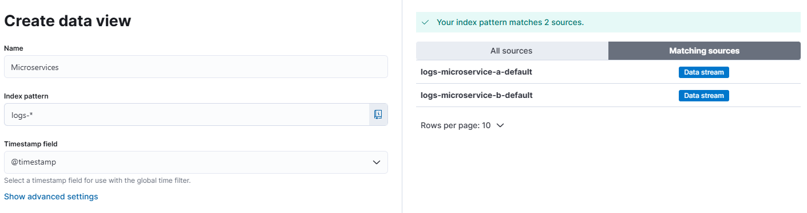

# Logs Microservices — OpenTelemetry, ElasticSearch & Kibana

## Objectif

Ce POC démontre la faisabilité de centraliser les logs de plusieurs microservices .NET dans **ElasticSearch**, en les enrichissant avec les identifiants de traçage **OpenTelemetry** (`TraceId` / `SpanId`), puis de les visualiser et de les corréler dans **Kibana**.

## Architecture

Le POC est composé de deux microservices ASP.NET Core qui communiquent entre eux en HTTP :

- **MicroserviceA** (`:5001`) expose `POST /job/start-job` et `POST /job/double-job`, qui appellent MicroserviceB.
- **MicroserviceB** (`:5002`) expose `GET /SayHello/say-hello` et `GET /Count/count`.

```
Client ──▶ MicroserviceA ──▶ MicroserviceB
              │                   │
              ▼                   ▼
           Serilog             Serilog
              │                   │
              └────────▶ ElasticSearch ◀────────┘
                              │
                              ▼
                            Kibana
```

Chaque service :
- log via **Serilog** vers la console et vers un data stream ElasticSearch dédié (`logs-microservice-a-default` / `logs-microservice-b-default`) grâce au package `Elastic.Serilog.Sinks`.
- enrichit chaque log avec le `TraceId` / `SpanId` de l'`Activity` OpenTelemetry courante, ce qui permet de corréler les logs des deux services pour une même requête dans Kibana.

## Prérequis

- [Docker Desktop](https://www.docker.com/products/docker-desktop/) (avec Docker Compose)
- [.NET 8 SDK](https://dotnet.microsoft.com/download/dotnet/8.0) (uniquement pour du développement/débogage local hors conteneur)

## Installation et lancement

Toutes les commandes sont à exécuter depuis le dossier [Microservices/](Microservices/).

### 1. Créer le réseau Docker partagé

Les deux fichiers `docker-compose` référencent un réseau externe commun, à créer une seule fois :

```bash
docker network create microservices-network
```

### 2. Lancer ElasticSearch et Kibana

```bash
docker-compose -f docker-compose.elasticsearch.yml up --build -d
```

### 3. Lancer les microservices

```bash
docker-compose -f docker-compose.microservices.yml up --build
```

## Configuration

| Service          | URL locale              | Remarque                                   |
|-------------------|--------------------------|---------------------------------------------|
| MicroserviceA      | http://localhost:5001    | Point d'entrée du POC                       |
| MicroserviceB      | http://localhost:5002    | Appelé par MicroserviceA                    |
| ElasticSearch      | http://localhost:9400    | Mappé sur le port interne 9200              |
| Kibana             | http://localhost:5601    |                                              |

> `xpack.security` est désactivé dans les deux conteneurs Elastic pour simplifier le POC. **À ne jamais faire en production.**

## Tester les endpoints

En POST, via Postman ou les fichiers `.http` fournis dans chaque projet ([MicroservicesA.http](Microservices/MicroserviceA/MicroservicesA.http), [MicroserviceB.http](Microservices/MicroserviceB/MicroserviceB.http)) :

- `POST http://localhost:5001/job/start-job`
- `POST http://localhost:5001/job/double-job`

## Visualisation des logs dans Kibana

1. Ouvrir http://localhost:5601/
2. Avoir appelé au moins une fois les microservices (sinon les index n'existent pas encore et la vue ne peut pas être créée).
3. Dans le menu de gauche : `Analytics > Discover`, puis créer une vue avec :
   - **Nom** : `Microservices`
   - **Index pattern** : `logs-*`
   - **Timestamp field** : `@timestamp`

   

4. Sauvegarder la vue.

Une fois les microservices appelés, deux sources de logs sont visibles :
- `logs-microservice-a-default`
- `logs-microservice-b-default`

## Stack technique

| Composant       | Rôle                                          | Lien                                             |
|------------------|------------------------------------------------|---------------------------------------------------|
| Serilog          | Génération des logs structurés                 | https://serilog.net/                               |
| Elastic.Serilog.Sinks | Envoi des logs Serilog vers ElasticSearch  | https://github.com/elastic/elastic-serilog-sinks   |
| OpenTelemetry    | Traçage distribué (TraceId / SpanId)           | https://opentelemetry.io/                           |
| ElasticSearch    | Stockage et indexation des logs                | https://www.elastic.co/elasticsearch/               |
| Kibana           | Visualisation des logs                         | https://www.elastic.co/kibana/                      |

## Notes

- Le `CorrelationId` (header `X-Correlation-ID`, voir `CorrelationIdMiddleware`) n'est plus nécessaire pour corréler les requêtes entre services : le `TraceId` OpenTelemetry remplit déjà ce rôle.
- Pour embarquer un dashboard Kibana dans une autre application, voir : https://www.elastic.co/blog/how-to-embed-kibana-dashboards
